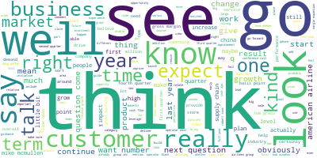
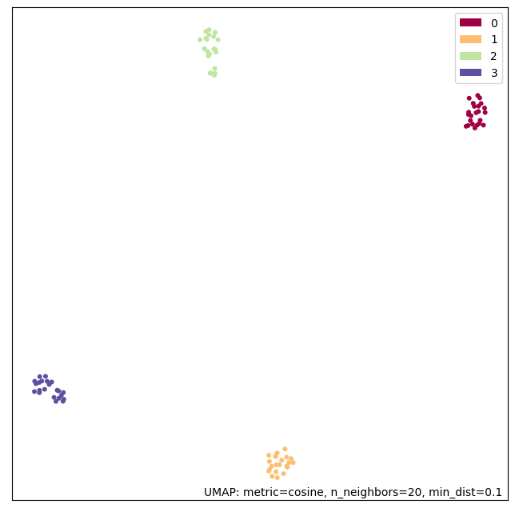
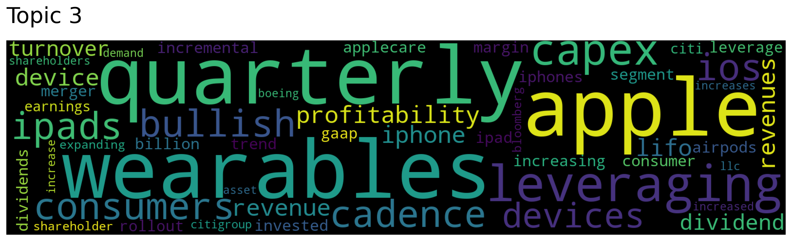

# ✨ Topic Analysis Adventure ✨

Welcome to my exciting journey through topic modeling with **LDA** and **Top2Vec**! I’ve explored these two powerhouse tools to unearth hidden themes in text data, and I’m thrilled to share the ups, downs, and discoveries along the way. Buckle up—let’s dive in! 🌊

---

## 🧠 LDA (Latent Dirichlet Allocation)

### 🎉 Why It’s Awesome
- **Multi-Topic Magic**: A single document can wear multiple topic hats—great for messy, real-world texts! 🌟
- **Small Data Superstar**: Performs like a champ even with smaller datasets. 📊

### 🛠️ Preprocessing Prep
To get LDA ready to roll, I whipped the data into shape using the open-source wizards **spaCy** and **NLTK**. Here’s what I did:
- 🚫 Kicked out **stopwords**, **punctuation**, **numbers**, and **special characters**.
- ✂️ Transformed words into their root forms with **lemmatization** (e.g., "running" → "run").
- 🔧 Expanded contractions like "I'm" → "I am" for consistency.

Check out the cool **word cloud** I generated to peek at the cleaned-up data!  

### ⚡ Training Time
I fired up the **LdaMulticore** model from **gensim** for this mission. It’s lightning-fast ⚡, but you’ve got to tell it how many topics to hunt for upfront. I tweaked and tuned it to see what stuck!

### 📈 Results Reveal
To bring the results to life, I used **pyLDAvis**—an open-source gem that creates interactive visualizations. Want to explore the full interactive version? Check it out here: `./results/ldavis_prepared_4.html`.

But here’s the tea ☕: The topics were… underwhelming. They lacked that “aha!” moment. Broad words like "quarter" and "think" hogged the spotlight across all topics, probably because the dataset was too skimpy. More data, please!  

---

## 🌌 Top2Vec: The Next Frontier

### 🎉 Why It Rocks
- **Embedding Power**: Uses fancy word embeddings for a deeper grasp of meaning. 🧬
- **Content Whisperer**: Gets the vibe of your documents like a pro. 🎯

### 🛠️ Preprocessing? Nope!
Top2Vec is the low-maintenance friend we all need—it handles **all preprocessing** internally. No manual scrubbing required. Just toss in your raw text and let it work its magic! ✨

### ⚡ Training Made Simple
Training Top2Vec is a breeze—just one line of code! For an extra boost, I plugged in a **pretrained sentence encoder** (shoutout to the GitHub repo’s sleek implementation!). It’s fast, efficient, and oh-so-satisfying.  

### 📈 Results That Wow
Top2Vec delivered the goods! It sniffed out **4 distinct topics**, neatly tied to the 4 companies in my dataset (nailed it!). The separation was crisp, and the topics actually made sense—way more than LDA managed here.  
Peek at these beauties:  
  

---

## 💭 Final Thoughts
**Top2Vec** stole the show with its slick performance and meaningful results, leaving LDA in the dust this time. But let’s be real—both models were starving for more data. My next move? Feed them a bigger corpus to unlock their full potential! 🍽️  
For future adventures, I’d double down on the Top2Vec approach—it’s got the edge I’m looking for. 🚀

---

## 🎖️ Credits
All the code-fu in this project comes from yours truly, **Moritz Enderle**. Want to see the magic behind the curtain? Check out the full codebase on GitHub: [M-Enderle/Topic-Modelling](https://github.com/M-Enderle/Topic-Modelling/). Big thanks to the open-source community for the tools that made this possible! 🙌

---

What do you think? Ready to explore topic modeling with me? Let’s chat! 💬
