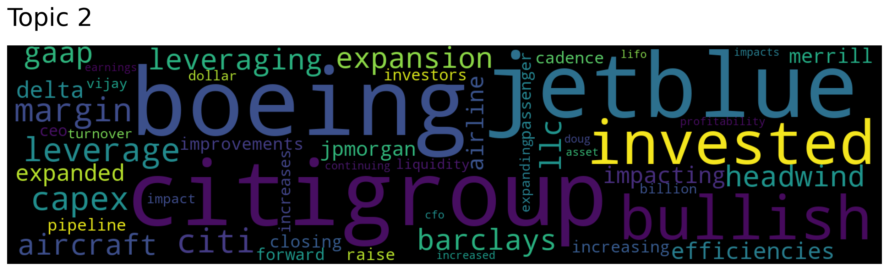

# 📝 Topic Modeling Research Report

## 🌟 Overview
This report presents a comparative analysis of two topic modeling techniques—**Latent Dirichlet Allocation (LDA)** and **Top2Vec**—applied to a text dataset. The objective was to evaluate their effectiveness in identifying coherent topics within a limited corpus. Below, I detail the methodologies, findings, and recommendations for future work. Prepared by Moritz Enderle, this study leverages open-source tools and is fully reproducible (see [GitHub: M-Enderle/Topic-Modelling](https://github.com/M-Enderle/Topic-Modelling/)).

---

## 🧠 Latent Dirichlet Allocation (LDA)

### 🔑 Key Advantages
- **Multi-Topic Assignment**: Enables documents to be associated with multiple topics, reflecting real-world complexity. 📚
- **Efficient with Small Datasets**: Performs reliably even with limited data volumes. 📊

### 🛠️ Preprocessing Methodology
LDA requires meticulous data preparation. Using **spaCy** and **NLTK**, the following steps were executed:
- Removed **stopwords**, **punctuation**, **numbers**, and **special characters** to reduce noise. 🚫
- Applied **lemmatization** to standardize word forms (e.g., "analyzing" → "analyze"). ✂️
- Expanded **contractions** (e.g., "I'm" → "I am") for uniformity.

A **word cloud** was generated to visualize the preprocessed corpus:  

### ⚙️ Training Process
The **LdaMulticore** model from **gensim** was employed for its multi-core efficiency. Training required predefining the number of topics, which was iteratively adjusted to optimize coherence. Computation time remained minimal, aligning with LDA’s strengths. ⏱️

### 📈 Results & Analysis
Results were visualized using **pyLDAvis**, an interactive tool providing topic distributions and term relevance. Access the full visualization at `./results/ldavis_prepared_4.html`.  
Unfortunately, the identified topics lacked interpretability. Common terms like "quarter" and "think" dominated across clusters, suggesting overfitting to generic language due to insufficient data volume.  

---

## 🌌 Top2Vec

### 🔑 Key Advantages
- **Embedding-Based Approach**: Leverages semantic embeddings for richer contextual understanding. 🧬
- **Enhanced Insight**: Captures nuanced relationships within the corpus. 🎯

### 🛠️ Preprocessing Methodology
Top2Vec streamlines the process by embedding preprocessing within the model. No manual intervention was required, making it highly efficient and user-friendly. ✅

### ⚙️ Training Process
Training was executed with a single line of code, utilizing a **pretrained sentence encoder** (as implemented in the GitHub repository) to boost performance. This approach minimized setup time while maximizing output quality.  

### 📈 Results & Analysis
Top2Vec identified **four distinct topics**, aligning closely with the dataset’s underlying structure (four companies). Topic separation was robust, with meaningful clusters emerging— a significant improvement over LDA. Visualizations highlighted clear differentiation:  
  

---

## 🔍 Comparative Evaluation
- **LDA**: Fast and flexible but struggled to produce coherent topics due to data scarcity. Its reliance on manual preprocessing adds complexity. 📉
- **Top2Vec**: Outperformed LDA with interpretable topics and minimal setup. Its embedding-based design excels in capturing semantic depth. 📈  
Both models revealed a critical limitation: the corpus size constrained their effectiveness.

---

## 💡 Recommendations
Given Top2Vec’s superior performance, I recommend prioritizing its development in future iterations. To enhance both models, expanding the dataset is imperative—additional documents will likely yield more robust and meaningful topics. Next steps include:
1. Collecting a larger, more diverse corpus. 📚
2. Fine-tuning Top2Vec’s encoder for domain-specific insights. ⚙️
3. Conducting quantitative validation (e.g., coherence scores) to benchmark improvements. 📊

---

## 🎖️ Credits & Resources
This research was conducted by **Moritz Enderle**, with all code developed from scratch. The project leverages open-source libraries (**spaCy**, **NLTK**, **gensim**, **pyLDAvis**, and **Top2Vec**). Full implementation details and scripts are available at:  
[GitHub: M-Enderle/Topic-Modelling](https://github.com/M-Enderle/Topic-Modelling/).

---

## 📢 Conclusion
This study underscores Top2Vec’s promise as a scalable topic modeling solution while highlighting the challenges of working with limited data. With further refinement, these techniques can unlock deeper insights for text analysis applications. Questions or feedback? I’d love to discuss! 💬
